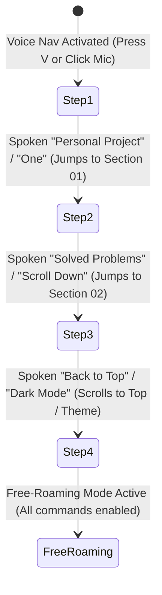

# Voice Navigation Engine & Guided Assistant (VUI) Documentation

This document outlines the architecture, UX patterns, speech recognition pipelines, and interaction models powering the hands-free Voice Navigation system on [amirf147.github.io](https://amirf147.github.io).

---

## 1. Overview & UX Design

The voice navigation system provides an intuitive, accessible, and tactile hands-free browsing experience. It combines real-time visual feedback, audio waveforms, interactive guided onboarding, and dual-engine speech recognition.

### Key UX Highlights:
- **Quick Destinations Menu**: Floating left drawer displaying all portfolio sections (`// 00` to `// 05`, `Back to Top`, and `Timeline`) with their associated voice keywords, live scroll-spy highlight tracking, and an expandable exhaustive cheatsheet view.
- **Real-Time Interim Transcripts**: Displays streaming hypotheses in a floating HUD bubble as words are spoken.
- **Context-Aware Focus Navigation**: Hands-free keyboard tab cycling (`"tab"`, `"tap"`, `"shift tab"`) that stays synchronized with the user's active viewport and section jumps.
- **Audio & Haptic Feedback**: Synth audio chimes (ascending frequency ramp for success, descending for error/pause) via the Web Audio API without external sound assets.
- **Full WCAG AAA & Theme Support**: Integrated with Dark, Light (`[data-theme="light"]`), and High Contrast (`[data-theme="high-contrast"]`) color token sets.

---

## 2. Dual-Engine Architecture

| Engine Mode | Target Browsers | Engine / Pipeline | Network / Privacy |
| :--- | :--- | :--- | :--- |
| **Mode 1: Native Cloud STT** | Chromium, Chrome, Edge, Safari, Brave, Opera | Web Speech Recognition API (`window.SpeechRecognition` / `webkitSpeechRecognition`) | Streams audio to native OS/browser speech recognizer |
| **Mode 2: Local Neural Engine** | Firefox, Waterfox, LibreWolf, Zen, Gecko engines | TensorFlow.js + Speech Commands (`BROWSER_FFT`) | 100% on-device FFT classification (~1.5 MB cached) |

### Automatic Gecko AudioContext Sample-Rate Adapter:
In Gecko-based browsers (Firefox/Waterfox), creating an `AudioContext` with a hardcoded sample rate (e.g. 44.1 kHz) when the physical hardware microphone operates at 48.0 kHz causes `createMediaStreamSource(stream)` to fail with a `NotSupportedError`. The engine dynamically intercepts and neutralizes hardcoded sample rate constraints to match hardware defaults.

---

## 3. Explored Concepts & Future Interactive Onboarding Architecture

During VUI design exploration, a step-by-step interactive onboarding tutorial card was developed to guide first-time visitors through progressive vocal commands (`"Personal Project"` ➔ `"Solved Problems"` ➔ `"Back to Top"` ➔ Full Hands-Free Mode). 

**Architecture Retrospective & Future Roadmap**:
- *Active Implementation*: A streamlined, distraction-free Quick Destinations menu with an expandable exhaustive cheatsheet toggle button.
- *Future Enhancement*: An optional, highly interactive visual overlay tutorial may be reintroduced in a dedicated onboarding mode or modal view.

---

## 4. Spoken Command Lexicon

The command processor uses forgiving regular expressions that accommodate variations, synonyms, singular/plural forms, and natural phrasing.

### 4.1 Section Navigation
| Destination | Primary Spoken Phrases | Numeric / Short Keywords |
| :--- | :--- | :--- |
| **// 00 Recent Activity** | `"recent activity"`, `"commits"`, `"live commits"`, `"github feed"` | `"zero"`, `"0"` |
| **// 01 Passion Project** | `"personal project"`, `"personal projects"`, `"passion project"`, `"caster"`, `"voice os"` | `"one"`, `"1"`, `"first"` |
| **// 02 Solved Problems** | `"solved problems"`, `"problems"`, `"problem"`, `"tracker"`, `"switcher"`, `"app switcher"` | `"two"`, `"2"`, `"second"` |
| **// 03 Open Source** | `"open source"`, `"contributions"`, `"pull requests"`, `"merged prs"`, `"dragonfly"`, `"pyvda"` | `"three"`, `"3"`, `"third"` |
| **// 04 Public Tools** | `"public tools"`, `"tools"`, `"tool"`, `"winstasis"`, `"vdtree"`, `"virtual desktop"` | `"four"`, `"4"`, `"fourth"` |
| **// 05 School & Engineering** | `"school projects"`, `"school"`, `"applied engineering"`, `"bms"`, `"mail"`, `"lidar"`, `"5g"` | `"five"`, `"5"`, `"fifth"` |
| **Evolution Timeline** | `"open timeline"`, `"timeline"`, `"evolution timeline"`, `"git history"` | `"timeline"` |

### 4.2 Stepping, Scrolling & Tab Navigation
| Action | Spoken Phrases |
| :--- | :--- |
| **Tab Forward** | `"tab"`, `"tap"`, `"tab forward"`, `"tap forward"`, `"next focus"`, `"tab next"` |
| **Shift-Tab (Backward)** | `"shift tab"`, `"shift tap"`, `"tab back"`, `"tap back"`, `"tab backward"`, `"prev focus"` |
| **Next Project** | `"next"`, `"next project"`, `"next item"`, `"next entry"` |
| **Previous Project** | `"prev"`, `"previous"`, `"previous project"`, `"prev entry"` |
| **Scroll Down** | `"scroll down"`, `"down"`, `"page down"`, `"go down"` |
| **Scroll Up** | `"scroll up"`, `"up"`, `"page up"`, `"go up"` |
| **Back to Top** | `"back to top"`, `"go to top"`, `"go to the top"`, `"scroll to top"`, `"top of the page"` |
| **Go to Bottom** | `"go to bottom"`, `"go to the bottom"`, `"scroll to bottom"`, `"bottom of the page"` |

### 4.3 Views, Visual Themes & Controls
| Action | Spoken Phrases |
| :--- | :--- |
| **Show All Commands** | `"show all commands"`, `"all commands"`, `"cheatsheet"`, `"full commands"` |
| **Simplified View** | `"simplified view"`, `"simple view"`, `"hide all commands"` |
| **Dismiss / Close Tutorial** | `"close tutorial"`, `"end tutorial"`, `"skip tutorial"`, `"hide tutorial"` |
| **Start / Open Tutorial** | `"start tutorial"`, `"show tutorial"`, `"tutorial"`, `"guided tour"` |
| **Dark Theme** | `"dark mode"`, `"dark theme"`, `"dark"` |
| **Light Theme** | `"light mode"`, `"light theme"`, `"light"` |
| **High Contrast** | `"high contrast"`, `"contrast mode"`, `"contrast"` |
| **Toggle Theme** | `"toggle theme"`, `"switch theme"`, `"cycle theme"` |
| **Open Guide / Help** | `"guide"`, `"help"`, `"commands"`, `"what can i say"` |
| **Close Guide / Dismiss** | `"close guide"`, `"hide guide"`, `"close drawer"`, `"dismiss"`, `"minimize"` |
| **Stop / Mute Voice** | `"stop listening"`, `"turn off mic"`, `"mute"`, `"pause voice"`, `"stop"` |

---

## 5. Keyboard Navigation & Accessibility (WCAG Parity)

- **Single-Key Shortcuts Sync**:
  - `v`: Toggles voice recognition on/off.
  - `0`–`5`: Instant direct section jumps.
  - `n` / `p`: Next / Previous project stepping.
  - `t`: Instant jump back to top.
  - `?`: Opens Accessibility Help Modal (`<dialog id="a11y-dialog">`).
- **Hands-Free Tab Traversal**: Spoken `"tab"` and `"shift tab"` commands traverse the DOM focus tree smoothly without requiring physical key presses.
- **Screen Reader Announcements**: Dedicated `#vui-aria-live` polite live region announces state changes and navigation feedback.
- **Focus Management**: Jump targets receive programmatic focus (`.focus({ preventScroll: true })`) to preserve keyboard focus rings and screen reader cursor alignment.
